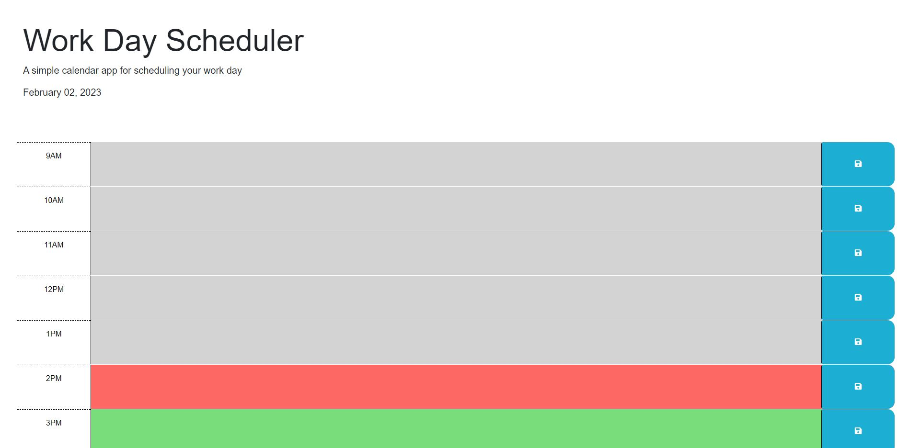

# 05 Third-Party APIs: Work Day Scheduler

## Description 

This application is a daily planner that will keep track and save tasks in a local storage.
The hourly line will show a gray color if its in the past, red if its live, and grren if its in the future. 
The application will keep track of all taks in a 9-5 workday schedule. 

Not many commits or changes with this code as it already had the starter code. 
I've only updated the HTML and JS. 